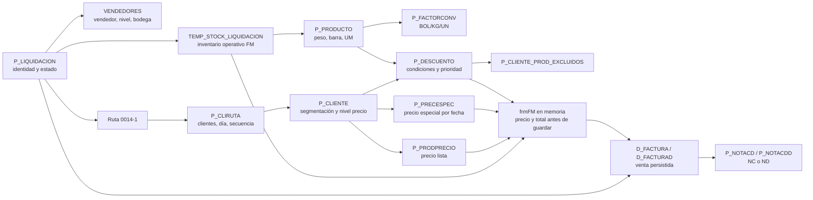

# Graph-path de datos: liquidación 357515

Fecha de evidencia: 2026-07-20
Ambiente verificado: `PTSVR2027 / ROADSAP_QAS`
Operación SQL: solo lectura

## Modelo de navegación

## Qué debe verse partiendo de una liquidación

1. **Identidad y ciclo:** código, fecha operativa, estado, abierta/cerrada, usuario, sucursal, correlativo de movimiento y banderas SAP/HH.
2. **Organización:** ruta, vendedor, ayudante, supervisor, bodega, subbodega y niveles comerciales.
3. **Clientes de ruta:** pertenencia, semana/día/secuencia, bloqueo, pago/crédito, nivel de precio y segmentos usados por descuentos (`TIPO`, `TIPOLOGIA`, `PRIORIZACION`, sucursal).
4. **Inventario:** producto, barra/lote, UM, cantidad/peso inicial, utilizado, DL, pallet y disponible. Debe distinguirse inventario fuente de inventario temporal operativo.
5. **Producto y conversiones:** venta por peso/barra, UM base, UM de precio y factores BOL/KG/UN.
6. **Precio:** precio especial exacto por fecha/UM si existe; en caso contrario, precio de lista por nivel del cliente.
7. **Promoción:** todas las condiciones candidatas, vigencia, rango, cantidad realmente evaluada, exclusión, prioridad y condición finalmente elegida.
8. **Documento:** factura encabezado/detalle, estado/anulación, fiscalización, pago, diferencias y referencia manual.
9. **Ajustes:** NC/ND, razón, producto, diferencia de precio/extensión y factura origen.
10. **Sincronización y auditoría:** `STATCOM`, `ENVIADO`, `ENVIAR_A_SAP`, usuario y timestamps para saber si el dato está solo en BOF, enviado o pendiente.

## Snapshot confirmado de 357515

| Dimensión | Evidencia QAS2 |
|---|---|
| Liquidación | `357515`, fecha `2026-07-20`, estado `NUEVA`, sucursal `3900` |
| Ruta y vendedor | `0014-1`; `00100834 - EDWIN A. ESQUIVEL`; bodega `3900`, subbodega `002` |
| Operadores | usuario/apertura `cfuentes`; ayudante `00101245`; supervisor `00107290` |
| Cliente de la captura | `0001002150 - REST. SLABON CAFE BISTRO (OBARRIO)` |
| Segmentación cliente | tipo `05`, nivel precio `3`, priorización `BC`, tipología `Z0022101`, sucursal `3900` |
| Producto | `0220 - FILETE MARIPOSA`; venta por peso y por barra; UM base `BOL`; peso corporativo `KG` |
| Inventario temporal | 16 barras/bolsas, cantidad disponible `16 BOL`, peso disponible `149.890 KG`; nada utilizado/DL/pallet |
| Barra visible en captura | `002200060401516756`, `1 BOL`, `9.320 KG` |
| Precio base | nivel 3, `5.84/KG`; no hay precio especial exacto para `2026-07-20` y UM `KG` |
| Persistencia | sin registros todavía en `D_FACTURA`, `D_FACTURAD`, `P_NOTACD` o `P_NOTACDD` para esta liquidación |

## Contraste precio/descuento de la captura

Para cantidad evaluada `9.320 KG`, la consulta que replica el DAL actual selecciona:

- `CODDESC=285`
- `ZK97-NA-0001583137-E3`
- rango `3..999999`
- porcentaje `1.5%`
- base `5.84`
- descuento redondeado `0.09`
- precio final esperado `5.75`

La captura muestra `5.81`, total `54.15` para `9.320 KG`. Ese precio equivale a descontar `0.03`, es decir, `0.5%`, que corresponde al tramo E1 (`1..1`). La hipótesis principal es que el runtime evaluó `cantidad=1` en vez de `peso=9.320`; la alternativa es deriva entre el binario ejecutado y el código de esta rama.

La traza `PROMOCION/AJUSTE_LINEA` agregada a `frmFM` permite resolverlo registrando en una misma fila `cantidadEval`, `precioBase`, `CODDESC`, rango, valor y precio resultante.

## Observaciones de arquitectura fina

- `TEMP_STOCK_LIQUIDACION` es la fuente efectiva de disponibilidad durante FM. Para esta liquidación no hay filas equivalentes en `P_STOCK`, `P_STOCKB` ni `P_INVENTARIO_BARRAS_RUTA` filtradas directamente por `CODIGOLIQUIDACION`; no deben confundirse capas fuente/histórica con el snapshot operativo.
- Una factura abierta en pantalla no puede reconstruirse completamente desde SQL antes de guardar: grid, precio calculado y total viven en memoria. La traza de archivo cubre ese vacío temporal.
- `P_PRECESPEC` exige coincidencia exacta de fecha y UM. Los históricos del cliente en `BOL` no aplican al precio actual en `KG`.
- La exclusión cliente-producto encontrada para `0001002150/0220` está inactiva (`ACTIVO=0`), por lo que no bloquea la condición el 2026-07-20.
- Para reproducibilidad, el script usa la fecha de la liquidación. El DAL vigente utiliza `GETDATE()`, lo cual puede producir resultados distintos si se investiga días después.

## Artefacto reproducible

Ejecutar `brain/sql/2026-07-20_liquidacion_graph_path_readonly.sql` cambiando los parámetros iniciales. El script no contiene credenciales y no ejecuta DML/DDL.
